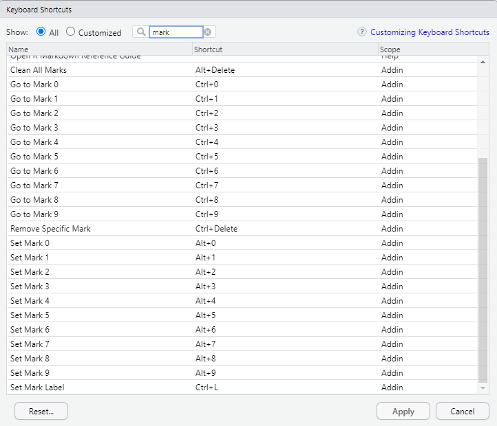
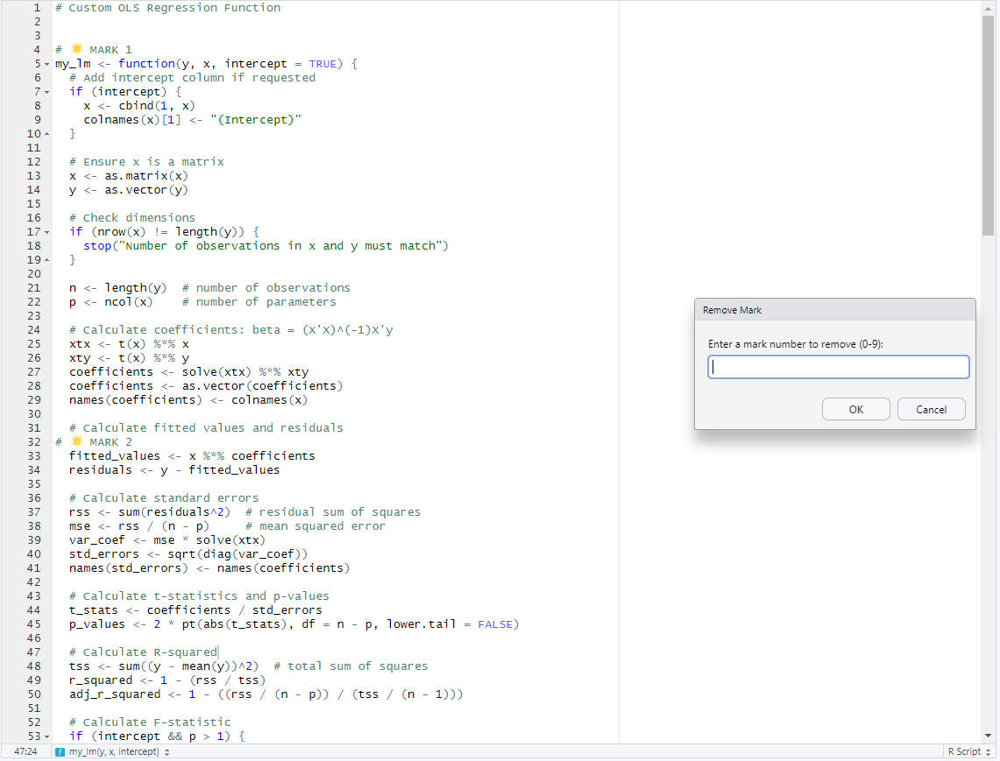

# rmarks

**rmarks** is an RStudio Addin package that allows you to visually mark and jump to lines of code using keyboard shortcuts.

### ✨ Features

- Add numbered visual marks to lines (0–9)
- Jump to any mark instantly
- Delete all marks with one command
- Prompt-based deletion of specific marks
- Visual comment markers (e.g., `# 🌟 MARK 3`)
- Full keyboard integration with RStudio Addins

---

## 🚀 Installation

```r
# If installed locally
devtools::install("path/to/rmarks")

# From GitHub (if available)
devtools::install_github("taufembackcg/rmarks")
```

- Please reboot RStudio after install.
- Then go to RStudio: Tools > Modify Keyboard Shortcuts and add your shortcuts.
- Below you can find some suggestions.



---

## Use

- Below you can see an example with 2 markers and the option to delete one of those.
- You can set a shortcut to delete only one, as well another to delete all of them.
- You can also change the marker's text.


