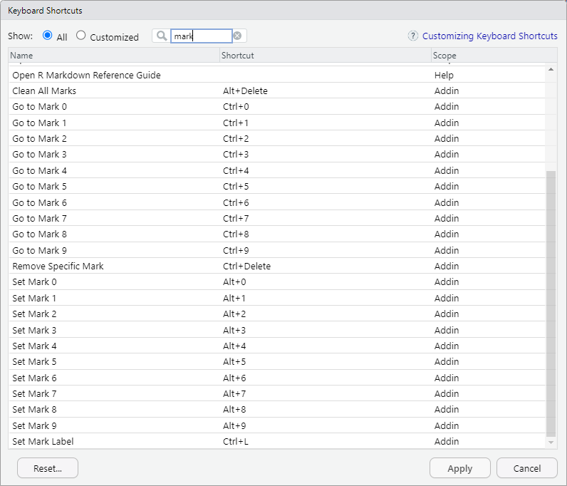
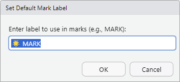

# rmarks

**rmarks** is an RStudio Addin package designed to streamline code navigation by allowing users to visually mark and jump to specific lines using customizable keyboard shortcuts.


## ✨ Key Features

- Add numbered visual marks (0–9) to lines of code  
- Instantly jump to any defined mark  
- Remove all marks with a single command  
- Selectively delete specific marks via prompt  
- Visual inline comments (e.g., `# 🌟 MARK 3`)  
- Seamless keyboard integration with RStudio Addins  

---

## 🚀 Installation

```r
# If installed locally
devtools::install("path/to/rmarks")

# From GitHub (if available)
devtools::install_github("taufembackcg/rmarks")
```

> **Note:**  
> 1. After installation, restart RStudio to activate the Addins.  
> 2. Navigate to **Tools > Modify Keyboard Shortcuts** to configure your preferred shortcuts.

---

## 💡 Suggested Keyboard Shortcuts



---

## 📌 Usage

- **Adding markers:** Below is an example of two visual markers applied in a script:  
  

- **Removing markers:**  
  Assign one shortcut to remove a specific mark and another to clear all marks:  
  

- **Customizing labels:**  
  Marker labels are fully customizable:  
  

---

